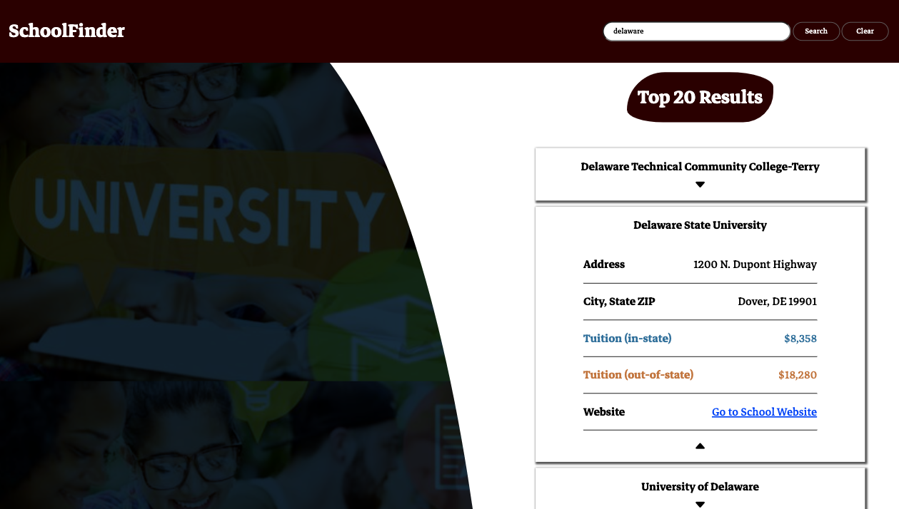

<a name="readme-top"></a>

<!-- PROJECT LOGO -->
<div align="center">
  <a href="">
    
  </a>
<h1 align="center">HTML + CSS & Client-Side JavaScript<br> Using Fetch with Public API's & Handling JSON Data</h1>
<h4>Learn how fetch and data from public API's are used to build dynamic web apps</h4>
</div>
<div align="center">
  <h3>
    <a href="#getting-started" target="_blank" rel="noreferrer noopener">Get Started</a>
  </h3>
</div>

<!-- SCREENSHOT -->
<h2 align="center">Screenshots</h2>

<div align="center">
  
  
  <h2 align="center"></h2>
</div>

<div align="center">
  
  
</div>

## Built With

[](https://html.com/html5/) [](https://www.w3schools.com/css/default.asp) [](https://ecma-international.org/publications-and-standards/standards/ecma-262/)

<!-- GETTING STARTED -->

## Getting Started

To complete the challenges and build this project you'll need a basic understanding of working with API's using JavaScript. Going through the #100Devs [JavaScript Basics: Classes 26-29](https://communitytaught.org/class/build-a-simple-app-using-apis) courses is a great place to start.

You can [download the project](https://github.com/RjayBrown/javascript-fetch-promise-chains/archive/refs/heads/main.zip) or clone and [run the project locally](https://github.com/RjayBrown/javascript-fetch-promise-chains#clone--run-locally) to get hands-on practice with the core concepts below.

### Core Concepts

- JavaScript: Arrays & Objects
- JavaScript: Fetch, API's & Handling JSON Data
- JavaScript: Function Scope & Syntax (ES5 vs. ES6)
- CSS: Default Browser Styles

### Review

Start in the practice folder, and after reviewing the code and comments in each file, try logging the search results in the console and exploring the JSON data that is returned before completing the challenges below.

### Practice

1. There is some buggy behavior going on! Only the most recent search results should be displayed without the user needing to manually clear the list.
2. For the home page, only the top 3 results should be returned, and for the results list page, the top 20 schools should be returned.
3. Add a new feature that allows the user to click on a school's name to expand the card and view basic information (as shown in the screenshots - the styles are already set up). You'll need to combine everything you've learned so far to complete this challenge, don't forget to use your resources and searching skills to help figure it out!

## Build a Mini-Project

Once you complete the courses and challenges you'll have the skills to use any public API to build a simple web app!!! You can choose one from this [list of public APIs](https://github.com/public-apis/public-apis), or find a public API on your own. Have fun, and don't forget to add your own style and creativity for how the data is displayed! You can use this mini-project as one of your submissions for the #100devs API assignment from class 26-27. The starter files are in the practice folder.

If you run into trouble, you can reach out in the #100Devs [[❓code-help]](https://discord.com/channels/735923219315425401/735925942559440997) channel on Discord. It's an amazing community space filled with supportive developers happy to answer any questions you have!

## Clone & Run Locally

1. Open the terminal in your code editor and type (or copy/paste):

   ```
   git clone https://github.com/RjayBrown/javascript-fetch-promise-chains
   ```

   - _**NOTE:** You can also click the green code button and copy the url (make sure HTTPS is selected)_

2. Navigate to the project folder

   ```
   cd javascript-fetch-promise-chains
   ```

You are now able to access and run the project locally.

<!-- ACKNOWLEDGEMENTS -->

## Acknowledgments

A big thanks to [@100devs](https://github.com/100devs) for the continued support, and [Leon Noel](https://github.com/leonnoel) for the project inspiration.

If you found some value here or just want to support, feel free to give the project a ⭐️!

### Additional Resources & Mini Projects

- [HTML/CSS - Semantic Elements & Basic CSS Styles](https://github.com/RjayBrown/html-css-introduction)
- [HTML/CSS - Containers & Responsive Design](https://github.com/RjayBrown/html-css-responsive-design)
- [HTML/CSS - Forms & More CSS Styles](https://github.com/RjayBrown/html-css-forms-and-styles)
- [JavaScript (Client-side) - The DOM(Introduction): User Interaction & Changing the DOM](https://github.com/RjayBrown/javascript-dom-intro)
- [JavaScript (Client-side) - Fetch API(Introduction): Promise Chains & Handling JSON](https://github.com/RjayBrown/javascript-fetch-json-data)
- [JavaScript (Client-side) - Fetch API(Advanced): Async/Await & Handling JSON](https://github.com/RjayBrown/war-the-card-game)
- [JavaScript (Server-side) - URL Endpoints with NodeJS(Introduction)](https://github.com/RjayBrown/olympics-info)
- [JavaScript (Full-Stack) - MVC Architecture(Introduction)](https://github.com/RjayBrown/hello-world)
- [JavaScript (Full-Stack) - MVC Architecture(Advanced): Authentication](https://github.com/RjayBrown/story-book) - Coming Soon!
- [JavaScript (Full-Stack) - MVC Architecture(Advanced): PostgreSQL](https://github.com/RjayBrown/b-u-b) - Coming Soon!
- [JavaScript (Full-Stack) - MVC Architecture(Advanced): ReactJS](https://github.com/RjayBrown/) - Coming Soon!

<!-- LICENSE -->

## License

This project is distributed under the MIT License. [Click here for more information](LICENSE).

<p align="right">[<a href="#readme-top">back to top</a>]</p>
